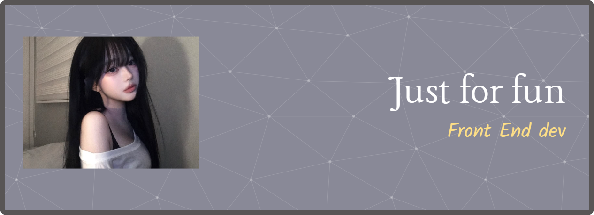
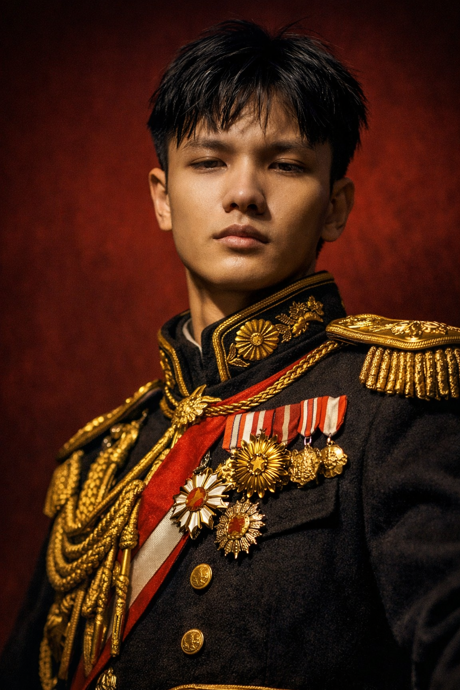

<!-- Version 2: All-in-one dengan spacing lebih rapat -->
<div align="center">
  <!-- Wave Header -->
  
  
  <!-- Teks Tengah Animated -->
  <div style="margin-top: -20px; margin-bottom: 10px;">
    
  </div>
  
  <!-- Border Pemisah -->
  
</div>

<br/>

<!-- Typing Animation -->
<div align="center">
  
</div>
<br/>




<!-- OPTION 2: Hitam + Text Putih (High Contrast) -->
<div align="center">
  <a href="https://git.io/typing-svg">
    
  </a>
</div>

<!-- Profile Stats Bar -->
<div align="center">
  
  
  
</div>
<br/>

##### **Skills & Interests**
***<br>Cyber Security 🔐 - Melindungi sistem dan data dari ancaman<br>***
***Front-End Development 🌐 - Membuat tampilan web yang menarik dan responsif<br>***
***Database Management 🗄️ - Mengelola dan mengorganisir data dengan efisien<br>***
<br>


<!--
<div>
  
</div>


**siswayangtidakmencolok-afk/siswayangtidakmencolok-afk** is a ✨ _special_ ✨ repository because its `README.md` (this file) appears on your GitHub profile.

Here are some ideas to get you started:

- 🔭 I’m currently working on ...
- 🌱 I’m currently learning ...
- 👯 I’m looking to collaborate on ...
- 🤔 I’m looking for help with ...
- 💬 Ask me about ...
- 📫 How to reach me: ...
- 😄 Pronouns: ...
- ⚡ Fun fact: ...
-->


###### ***language***
      

###### ***hosting***
   
##### ***Framework&Library***
      [](https://github.com/siswayangtidakmencolok-afk) [](https://gitlab.com/siswayangtidakmencolok) [](https://open.spotify.com/user/31dibr75l6es4qzurcofomvttdlm)


  
</div>

## 📊 Performance & Skills Overview

### 📈 Daily Productivity Breakdown

<div align="center">

| Time | Hours | Productivity | Activity | Performance |
|:---:|:---:|:---:|:---|:---:|
| 🌅 Morning | 06:00-12:00 | 55% ███████████░░░░░░░░░ | Planning & Ideas | ⚡⚡⚡ |
| ☀️ Daytime | 12:00-17:00 | 95% ███████████████████░ | Peak Implementation | ⚡⚡⚡⚡⚡ |
| 🌆 Evening | 17:00-21:00 | 80% █████████████████░░░ | Debugging & Testing | ⚡⚡⚡⚡ |
| 🌙 Night | 21:00-00:00 | 77% ████████████████░░░░ | Creative Coding | ⚡⚡⚡⚡ |

</div>

  
</div>

### 🎯 Technical Skill Proficiency

<div align="center">

| Technology | Level | Mastery |
|:---|:---|:---:|
| 🌐 Web Dev | Mahir | 90% ██████████████████████░░ |
| 📂 Git & GitHub | Lumayan Mahir | 85% ████████████████████░░░░ |
| 🗄️ MySQL | Lumayan Mahir | 82% ███████████████████░░░░░ |
| 🔥 Java | Cukup Mahir | 82% ███████████████████░░░░░ |
| 🤖 Robotics | Cukup Mahir | 73% ████████████████░░░░░░░░ |
| 🎨 UI/UX Design | Kurang Mahir | 49% ████████████░░░░░░░░░░░░ |
| 🍃 Spring Boot | Kurang Mahir | 49% ████████████░░░░░░░░░░░░ |
| 📱 Flutter | Kurang Mahir | 40% ████████░░░░░░░░░░░░░░░░ |

**Average: 79.9%** • **Strongest: Web Dev** • **Growing: Flutter & Spring Boot**

</div>

  
</div>

### ⏱️ Weekly Development Activity

<div align="center">

| Language | Time | Distribution |
|:---|---:|:---:|
| 🗄️ MySQL/SQL | m | 89.0% ██████████████████░░░ |
| 🎨 HTML/CSS | m | 60.1% █████████████░░░░░░░░ |
| ⚡ JavaScript | m | 40.5% ████████░░░░░░░░░░░░░ |
| 🔥 Java | m | 28.5% ████░░░░░░░░░░░░░░░░░ |
| 🤖 Arduino/C++ | m | 7.1% █░░░░░░░░░░░░░░░░░░░░ |
| 📱 Flutter/Dart | m | 3.9% ░░░░░░░░░░░░░░░░░░░░░ |

**📅 Total:** x m • **🔥 Streak:** x days • **⭐ Best Day:** Wenesday • **🎯 Daily Avg:** 4.4h

</div>

  
</div>

## 🌐 Socials:

<div align="center">
  
</div>
____

#####


<div align="left">
  <a href="https://www.youtube.com/@zxyninety293" target="_blank">
    
  </a>
  <a href="https://paypal.me/FhazwanAthar?locale.x=id_ID&country.x=ID" target="_blank">
    
  </a>
  <a href="https://whatsapp.com/0895403891152" target="_blank">
    
  </a>
  <a href="https://gitlab.com/siswayangtidakmencolok" target="_blank">
    
  </a>
  <a href="https://www.instagram.com/f.zvvn_/" target="_blank">
    
  </a>
  <a href="https://www.facebook.com/share/1QzXJnQtXt/" target="_blank">
    
  </a>
  <a href="mailto:siswayangtidakmencolook@gmail.com" target="_blank">
    
  </a>
  <a href="https://stackoverflow.com/users/31517680/zxyninety" target="_blank">
    
  </a>
  <a href="https://www.twitch.tv/fhazwan" target="_blank">
    
  </a>
  <a href="https://t.me/Art_zwn" target="_blank">
    
  </a>
  <a href="www.linkedin.com/in/fhazwan26092008" target="_blank">
    
  </a>
  <a href="https://discord.com/channels/@zxyninety" target="_blank">
    
  </a>
  <a href="https://x.com/www.x.com/zxyninety1" target="_blank">
  
  </a>
  
  
  <a href="https://tiktok.com/@www.tiktok.com/eksrovertselalu" target="_blank">
    
  </a>
</div>

###

<div align="center">
  
  
</div>
<div align="center">
  
  
  
</div>


##### 🎵 Current Favorites

<div align="center">

| # | Track | Artist | Spotify |
|---|-------|--------|---------|
| 1 | We Don't Talk Anymore | Charlie Puth ft. Selena Gomez | [](https://open.spotify.com/track/37BZB0z9T8Xu7U3e65qxFy) |
| 2 | COLLIDE | JUstin Skye | [](https://open.spotify.com/intl-id/track/22I3h5AOENlH4CqXJsEbFR?si=d208429b6e714a74) |
| 3 | Love Not Me | Ravyn Lenae | [](https://open.spotify.com/intl-id/track/1UNEuG9DYOWiikf00ayr52?si=d542dc4237f94d7f) |
| 4 | Cook Pardon | Lvbel C5 | [](https://open.spotify.com/intl-id/track/0P45YtqtAT6AkNDDX1lySE?si=cb19fbbbac444202) |

</div>

<div align="center">
  <a href="https://open.spotify.com/user/31dibr75l6es4qzurcofonvttdlm?si=15d3e7c4648c4fd1">
    
  </a>
</div>

###

<div align="center">
  
</div>

<div>
  
</div>

###

# 📊 GitHub Stats:


<div align="center">
   <br>
   <br>
  
</div>

<!-- Medium Articles Section -->
<div align="center">
  
  #### 📝 Latest Medium Biografiest
  
  <a target="_blank" href="https://github-readme-medium-recent-article.vercel.app/medium/@siswayangtidakmencolok/0">
    
  </a>
</div>

<br/>

##### 📝 Latest Projects

<div align="center">
  <a href="https://github.com/siswayangtidakmencolok-afk/AnimeAPP-AnimeHub-">
    
  </a>
</div>

### ✍️ Random Dev Quote


---
[](https://visitcount.itsvg.in)

<<<<<<< HEAD

=======

<div align="center">
  
</div>

``` 
Terima kasih sudah mampir! Jangan ragu untuk melihat-lihat project saya dan mari kita belajar bersama! 🚀
```