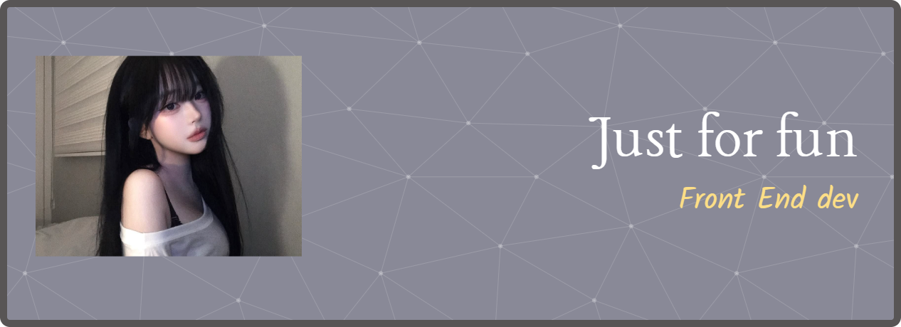
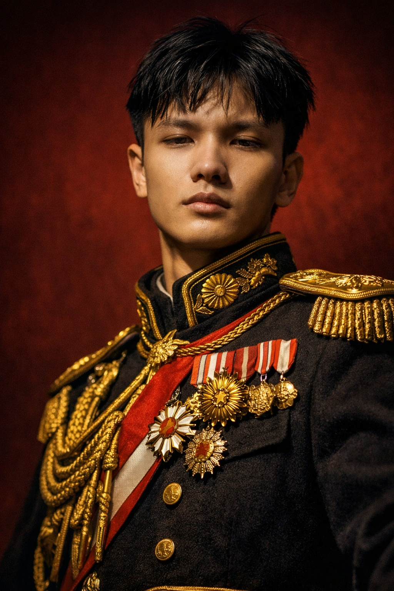

<!-- Version 2: All-in-one dengan spacing lebih rapat -->
<!-- Wave Header -->
<div align="center">
  
</div>

<!-- Teks Animated Subtitle -->
<div align="center">
  
</div>
<!-- Banner dengan Foto + Animated Border -->
<div align="center">
  
  <!-- Animated Top Border -->
  
  
  <!-- Photo Banner dengan Frame -->
  
  
  <!-- Animated Bottom Border -->
  
  
</div>


<br/>


<!-- Profile Stats Bar -->
<div align="center">
  
  
  
</div>

<br/>

<div align="center">
<br>
  
</div>
<br/>

<div align="center">
  
</div>
<br/>

<div align="center">
  
</div>
<br/>

<div align="center">
  
</div>

<!-- Animated Title -->
<div align="center">
  
</div>

<!-- Hook Statement -->
<div align="center">
  
</div>

<br/>

<!-- Glowing Line -->


<br/>

<!-- Three Pillars -->
<div align="center">

<table>
<tr>
<td align="center" width="33%">

<br/><br/>
<h3>🎨 Creator</h3>
<sub>Drawing • Editing • UI/UX<br/><b>🥇 Competition Winner</b></sub>
</td>
<td align="center" width="33%">

<br/><br/>
<h3>💪 Optimizer</h3>
<sub>Gym • Guitar • Cooking<br/><b>Discipline & Process</b></sub>
</td>
<td align="center" width="33%">

<br/><br/>
<h3>📚 Strategist</h3>
<sub>Manga • Writing • Gaming<br/><b>Think Ahead</b></sub>
</td>
</tr>
</table>

</div>

<br/>

<!-- Impact Section -->
<div align="center">


<br/>


<br/>


</div>

<!--
<div>
  
</div>


**siswayangtidakmencolok-afk/siswayangtidakmencolok-afk** is a ✨ _special_ ✨ repository because its `README.md` (this file) appears on your GitHub profile.

Here are some ideas to get you started:

- 🔭 I’m currently working on ...
- 🌱 I’m currently learning ...
- 👯 I’m looking to collaborate on ...
- 🤔 I’m looking for help with ...
- 💬 Ask me about ...
- 📫 How to reach me: ...
- 😄 Pronouns: ...
- ⚡ Fun fact: ...
-->

  

###### ***language***
             


###### ***hosting***
[](https://app.netlify.com/fhazwann)  [](https://vercel.com/fhazwan) 
##### ***Framework&Library***
              

##### ***AcountLearning&Other***
[](https://github.com/siswayangtidakmencolok-afk) [](https://gitlab.com/siswayangtidakmencolok)   [](https://www.udemy.com/user/zxyninety/) [](https://www.figma.com/files/team/1546845687377263432/recents-and-sharing?fuid=1546845684957787578) [](https://lightroom.adobe.com/libraries/cc82ba9c4aab4af081a3ef01c62f760a/assets?panel=organize)   

  


## 📊 Performance & Skills Overview

### 📈 Daily Productivity Breakdown

<div align="center">

| Time | Hours | Productivity | Activity | Performance |
|:---:|:---:|:---:|:---|:---:|
| 🌅 Morning | 06:00-12:00 | 55% ███████████░░░░░░░░░ | Planning & Ideas | ⚡⚡⚡ |
| ☀️ Daytime | 12:00-17:00 | 95% ███████████████████░ | Peak Implementation | ⚡⚡⚡⚡⚡ |
| 🌆 Evening | 17:00-21:00 | 80% █████████████████░░░ | Debugging & Testing | ⚡⚡⚡⚡ |
| 🌙 Night | 21:00-00:00 | 77% ████████████████░░░░ | Creative Coding | ⚡⚡⚡⚡ |

</div>

  

### 🎯 Technical Skill Proficiency

<div align="center">

| Technology | Level | Mastery |
|:---|:---|:---:|
| 🌐 Web Dev | Mahir | 90% ██████████████████████░░ |
| 📂 Git & GitHub | Lumayan Mahir | 85% ████████████████████░░░░ |
| 🗄️ MySQL | Lumayan Mahir | 82% ███████████████████░░░░░ |
| 🔥 Java | Cukup Mahir | 82% ███████████████████░░░░░ |
| 🤖 Robotics | Cukup Mahir | 73% ████████████████░░░░░░░░ |
| 🎨 UI/UX Design | Kurang Mahir | 49% ████████████░░░░░░░░░░░░ |
| 🍃 Spring Boot | Kurang Mahir | 49% ████████████░░░░░░░░░░░░ |
| 📱 Flutter | Kurang Mahir | 40% ████████░░░░░░░░░░░░░░░░ |

**Average: 79.9%** • **Strongest: Web Dev** • **Growing: Flutter & Spring Boot**


  

### ⏱️ Weekly Development Activity

<div align="center">

| Language | Time | Distribution |
|:---|---:|:---:|
| 🗄️ MySQL/SQL | m | 89.0% ██████████████████░░░ |
| 🎨 HTML/CSS | m | 60.1% █████████████░░░░░░░░ |
| ⚡ JavaScript | m | 40.5% ████████░░░░░░░░░░░░░ |
| 📲 PHP | m | 70.2% ██████████████░░░░░░░ |
| 🤖 Arduino/C++ | m | 7.1% █░░░░░░░░░░░░░░░░░░░░ |
| 🐍 Python | m | 80.0% ██████████████████░░░ |
| 📱 Kotlin | m | 10.0% █░░░░░░░░░░░░░░░░░░░░ |
| 📱 Flutter/Dart | m | 19.0% ███░░░░░░░░░░░░░░░░░ |

**📅 Total:** x m • **🔥 Streak:** x days • **⭐ Best Day:** Wenesday • **🎯 Daily Avg:** 4.4h

  

<div align="center">
  
</div>

<div align="center">
  

<table>
<tr>
<td width="33%" valign="top">

#### 🤖 Smart Robotics System


**Tech Stack:**
`Arduino` `C++` `IoT` `Sensors`

[](https://app.netlify.com/projects/globe3dsystemsolar/deploys)

Autonomous robot dengan AI navigation system yang bisa mendeteksi objek dan menghindari rintangan.

**🏆 Achievement:** 🥉 3rd Place Otonom Competition 2024

[View Project →](https://github.com/siswayangtidakmencolok-afk/Teacher-Absence)

</td>
<td width="33%" valign="top">

#### 👨‍🏫 Teacher Absence Web


**Tech Stack:**
`PHP` `Laravel` `Railway` `MySQL`

Web application untuk sistem absensi guru dengan fitur real-time tracking dan reporting.

**📊 Impact:** Bisa buat absensi guru dan code sudah bisa di-clone **FREE**

[🌐 Live Demo](https://teacher-absence-production.up.railway.app/) • [📁 Source Code](https://github.com/siswayangtidakmencolok-afk/Teacher-Absence)

</td>
<td width="33%" valign="top">

#### 📱 App Food Order (React)


**Tech Stack:**
`React Native` `JavaScript` `Vercel` `React`

Aplikasi order makanan dengan fitur lengkap dan **open source**. Deployed di Vercel dengan performance optimal.

**✨ Features:** Menu catalog, cart system, order tracking

[🌐 Visit Website](https://app-pemesananmakanan.vercel.app/) • [📁 Source Code](https://github.com/siswayangtidakmencolok-afk/App_food_order-ReactNative-)

</td>
</tr>
</table>

**📁 View All Projects:** [GitHub Repositories](https://github.com/siswayangtidakmencolok-afk?tab=repositories)

</div>


<div align="center">
  
</div>


<div align="center">


<br/>

<table>
<tr>
<td align="center" width="20%">

<br/>
<b>Design Thinking</b><br/>
<sub>UI/UX</sub>
</td>
<td align="center" width="20%">

<br/>
<b>Pattern Recognition</b><br/>
<sub>Music & Guitar</sub>
</td>
<td align="center" width="20%">

<br/>
<b>Process Optimization</b><br/>
<sub>Cooking</sub>
</td>
<td align="center" width="20%">

<br/>
<b>Storytelling</b><br/>
<sub>Novel Writing</sub>
</td>
<td align="center" width="20%">

<br/>
<b>Strategic Thinking</b><br/>
<sub>Gaming</sub>
</td>
</tr>
</table>


</div>


**📚 Currently Learning:**
- Cloud Computing (AWS)
- AI & Machine Learning
- Advanced Spring Boot
- System Design

---

<div align="center">
  
</div>


<div align="center">
<table>
<tr>
<td align="center" width="25%">

<br/>

<br/><br/>
<sub>Rasa ingin tahu yang tinggi mendorong saya untuk terus belajar</sub>
</td>
<td align="center" width="5%">
<h2>→</h2>
</td>
<td align="center" width="25%">

<br/>

<br/><br/>
<sub>Belajar dengan praktik, bukan hanya teori</sub>
</td>
<td align="center" width="5%">
<h2>→</h2>
</td>
<td align="center" width="25%">

<br/>

<br/><br/>
<sub>Berbagi ilmu dan kode dengan komunitas</sub>
</td>
<td align="center" width="5%">
<h2>→</h2>
</td>
<td align="center" width="25%">

<br/>

<br/><br/>
<sub>Fokus pada solusi yang impactful dan practical</sub>
</td>
</tr>
</table>


</div>


<div align="center">
  
</div>

<div align="center">

<br/>

<!-- Timeline Item 1 -->
<table>
<tr>
<td width="5%" align="right">

</td>
<td width="2%">
<h2>│</h2>
</td>
<td width="93%">

<br/>
<sub>Status: 🔄 <b>In Progress (40%)</b> | Target: <b>June 2025</b></sub>
<br/><br/>
</td>
</tr>
</table>

<!-- Timeline Item 2 -->
<table>
<tr>
<td width="5%" align="right">

</td>
<td width="2%">
<h2>│</h2>
</td>
<td width="93%">

<br/>
<sub>Status: 📚 <b>Studying</b> | Target: <b>December 2025</b></sub>
<br/><br/>
</td>
</tr>
</table>

<!-- Timeline Item 3 -->
<table>
<tr>
<td width="5%" align="right">

</td>
<td width="2%">
<h2>│</h2>
</td>
<td width="93%">

<br/>
<sub>Status: 🌱 <b>Planning</b> | Target: <b>Q3 2025</b></sub>
<br/><br/>
</td>
</tr>
</table>

<!-- Timeline Item 4 -->
<table>
<tr>
<td width="5%" align="right">

</td>
<td width="2%">
<h2>│</h2>
</td>
<td width="93%">

<br/>
<sub>Status: 🎯 <b>Ongoing</b> | Target: <b>Throughout 2025</b></sub>
<br/><br/>
</td>
</tr>
</table>

<!-- Timeline Item 5 -->
<table>
<tr>
<td width="5%" align="right">

</td>
<td width="2%">
<h2>▼</h2>
</td>
<td width="93%">

<br/>
<sub>Status: 📝 <b>Started</b> | Target: <b>Ongoing</b></sub>
</td>
</tr>
</table>


</div>

<div align="center">
  
</div>

<div align="center">

Saya selalu terbuka untuk **collaboration**, **learning opportunities**, dan **tech discussions**. 

Punya project idea? Butuh developer? Atau sekadar mau ngobrol tentang tech? **Feel free to reach out!**

[](mailto:siswayangtidakmencolok@gmail.com)
[](https://github.com/siswayangtidakmencolok-afk)
[](https://medium.com/@siswayangtidakmencolok)
[](https://instagram.com/f.zvvn_)

**💬 Response Time:** Usually within 24 hours

</div>


<div align="center">
  
<div align ="center">  


<div align="left">
  <a href="https://www.youtube.com/@zxyninety293" target="_blank">
    
  </a>
  <a href="https://paypal.me/FhazwanAthar?locale.x=id_ID&country.x=ID" target="_blank">
    
  </a>
  <a href="https://wa.me/qr/RKCJNQUSIH6VF1" target="_blank">
    
  </a>
  <a href="https://gitlab.com/siswayangtidakmencolok" target="_blank">
    
  </a>
  <a href="https://www.instagram.com/f.zvvn_/" target="_blank">
    
  </a>
  <a href="https://www.facebook.com/share/1QzXJnQtXt/" target="_blank">
    
  </a>
  <a href="mailto:siswayangtidakmencolook@gmail.com" target="_blank">
    
  </a>
  <a href="https://stackoverflow.com/users/31517680/zxyninety" target="_blank">
    
  </a>
  <a href="https://www.twitch.tv/fhazwan" target="_blank">
    
  </a>
  <a href="https://t.me/Art_zwn" target="_blank">
    
  </a>
  <a href="www.linkedin.com/in/fhazwan26092008" target="_blank">
    
  </a>
  <a href="https://discord.com/channels/@zxyninety" target="_blank">
    
  </a>
  <a href="https://x.com/www.x.com/zxyninety1" target="_blank">
  
  </a>
  
  
<a href="https://www.tiktok.com/@eksrovertselalu" target="_blank">
  
</a>
  <a href="https://v.douyin.com/iV_CXQKGq9U/ 复制此链接，打开Dou音搜索，直接观看视频" target="_blank">
    
  </a>
</div>

###

<div align="center">
  
  
</div>
<div align="center">
  
  
  
</div>


##### 🎵 Current Favorites

<div align="center">

| # | Track | Artist | Spotify |
|---|-------|--------|---------|
| 1 | We Don't Talk Anymore | Charlie Puth ft. Selena Gomez | [](https://open.spotify.com/track/37BZB0z9T8Xu7U3e65qxFy) |
| 2 | COLLIDE | JUstin Skye | [](https://open.spotify.com/intl-id/track/22I3h5AOENlH4CqXJsEbFR?si=d208429b6e714a74) |
| 3 | Love Not Me | Ravyn Lenae | [](https://open.spotify.com/intl-id/track/1UNEuG9DYOWiikf00ayr52?si=d542dc4237f94d7f) |
| 4 | Cook Pardon | Lvbel C5 | [](https://open.spotify.com/intl-id/track/0P45YtqtAT6AkNDDX1lySE?si=cb19fbbbac444202) |

</div>

<div align="center">
  
</div>


<div align="center">
  
</div>

#####

  

# 📊 GitHub Stats:


<!-- Begin Stats Cards -->
<!-- Resources:  -->
<!-- Github & Languages Stats: https://github.com/anuraghazra/github-readme-stats --> 
<!-- Streak Stats: https://github.com/denvercoder1/github-readme-streak-stats -->
<!-- Change the value after ?username= to your GitHub username. -->


   <br>
  
  
## 🏆 GitHub Achievements

<div align="center">
  


<sub>🌱 Building up achievements...</sub>

</div>

---
<!--  End Stats Cards -->

<!-- Medium Articles Section -->
<div align="center">
  
  #### 📝 Latest Medium Biografiest

<div align="right" style="width: 100%">
  <a target="_blank" href="https://github-readme-medium-recent-article.vercel.app/medium/@siswayangtidakmencolok/0">
    
  </a>
  <a target="_blank" href="https://github-readme-medium-recent-article.vercel.app/medium/@siswayangtidakmencolok/1">
    
  </a>
</div>


[](https://visitcount.itsvg.in)

##### **contribution activity snake's**


### ✍️ Random Dev Quote

<div align="center">
  
</div>

``` 
Terima kasih sudah mampir! Jangan ragu untuk melihat-lihat project saya dan mari kita belajar bersama! 🚀
```

---

## 🎨 Design Portfolio

<div align="center">

### UI/UX Projects

<table>
<tr>
<td align="center" width="50%">
<br/>
<sub><b>E-Commerce Mobile App</b></sub><br/>
<sub>Figma • User Research</sub>
</td>
<td align="center" width="50%">
<br/>
<sub><b>Dashboard Analytics</b></sub><br/>
<sub>Adobe XD • Wireframing</sub>
</td>
</tr>
</table>

**🔗 View Full Portfolio:** [Figma](https://www.figma.com/@fhazwanathar) • [Behance](https://www.behance.net/zxyninefhazwa)

</div>

---
